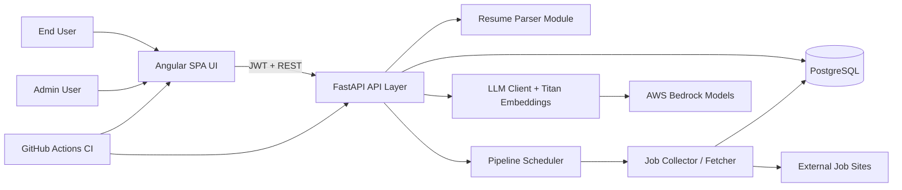
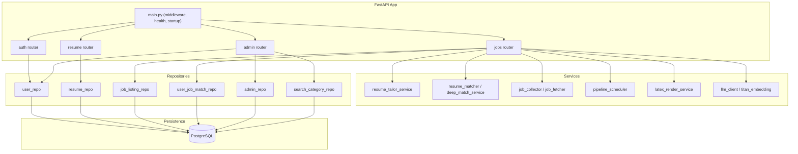
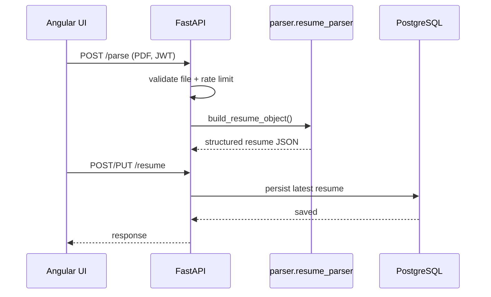
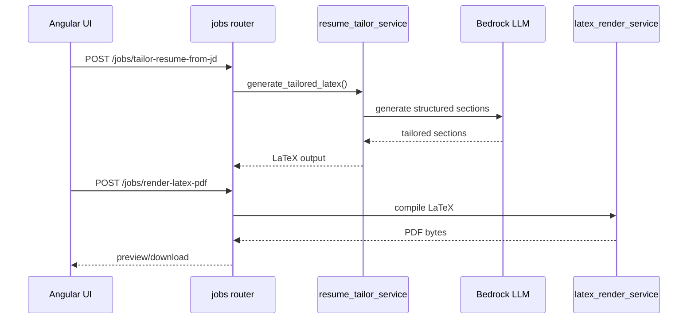
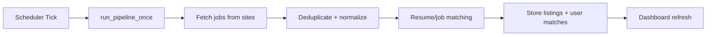
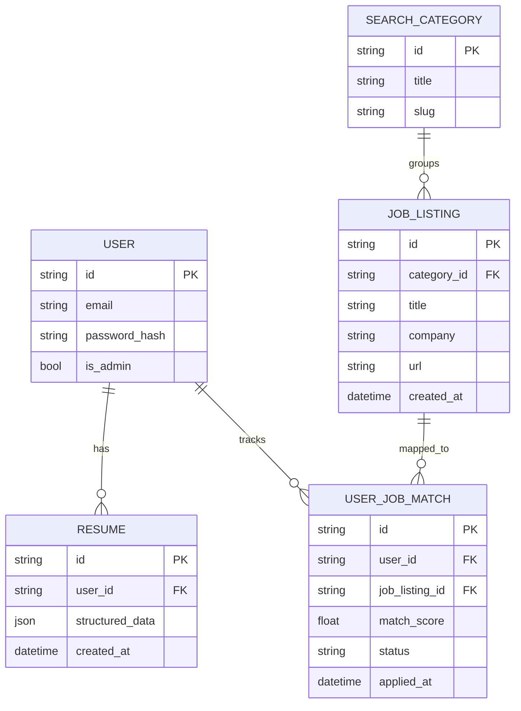

# JobFetch

AI-assisted job discovery, matching, and resume tailoring platform.

JobFetch combines a FastAPI backend, Angular frontend, and PostgreSQL storage to provide:
- Authenticated resume parsing and management
- Matched job listings with status tracking
- AI resume tailoring from either saved jobs or pasted job descriptions
- Admin operations for users, categories, and pipeline controls

---

## System Design at a Glance



---

## Architecture Principles

- **Layered backend architecture**: routers -> services -> repositories -> database.
- **Separation of concerns**: auth, resume, jobs, and admin domains are isolated.
- **Resilience by fallback**: resume tailoring falls back to deterministic structured generation when LLM calls fail.
- **Security-first defaults**: JWT auth, route guards, request rate limiting, and production placeholder checks.
- **Test and quality gates**: backend coverage gate at 90% in CI.

---

## Backend Component Architecture



---

## Core Runtime Flows

### 1) Resume Parse and Save



### 2) Tailor Resume from Job Description



### 3) Job Collection Pipeline



---

## Data Model (Logical ER)



---

## Repository Layout

```text
JobFetchAgent/
├── FastAPI/
│   ├── app/
│   │   ├── core/          # security, rate limiter
│   │   ├── models/        # SQLAlchemy entities
│   │   ├── repos/         # DB access layer
│   │   ├── routers/       # API endpoints by domain
│   │   ├── services/      # business + integration logic
│   │   ├── scripts/       # operational scripts
│   │   └── main.py        # app wiring, middleware, health
│   ├── tests/             # backend tests (pytest)
│   ├── pytest.ini
│   └── requirements.txt
├── parser/                # resume parsing pipeline
├── ui/                    # Angular frontend
│   └── src/app/features/  # auth, dashboard, resume, admin, etc.
└── .github/workflows/     # CI/CD workflows
```

---

## API Surface (High Level)

- **Auth**: register, login, forgot-password, change-password, me/profile, delete account.
- **Resume**: get/update latest structured resume.
- **Jobs**: matched/applied lists, status changes, skip/delete, pipeline control, tailoring + PDF rendering.
- **Admin**: stats, users CRUD, category seed/list, job listing management.
- **Health**: liveness/readiness endpoints.

---

## Security Design

- JWT token-based auth with guarded routes.
- Password hashing and temporary-password rotation flow.
- Endpoint-specific in-memory rate limiting:
  - auth endpoints
  - parse endpoint
  - tailoring endpoints
  - PDF render endpoint
- Startup safety checks to reject placeholder secrets in production mode.

---

## Reliability and Operability

- Global exception handling for stable error responses.
- Ready/live probes for platform health checks.
- Pipeline scheduler controls exposed via API and admin UI.
- Operational scripts for DB init, migration, admin promotion, and pipeline execution.

---

## Testing and Quality Gates

- Backend test framework: `pytest`
- Coverage: `pytest-cov`
- Gate: `--cov-fail-under=90`
- CI workflow runs:
  - Backend tests with coverage artifact upload
  - Frontend production build validation

---

## CI/CD

- **CI**: `/.github/workflows/ci.yml`
  - Runs on push/PR to `main`
  - Validates backend + frontend
- **Deploy**: `/.github/workflows/deploy.yml`
  - Manual trigger
  - SSH-based deployment template (with secrets)

Recommended branch policy:
- Protect `main`
- Require PRs + passing checks + review
- Disable bypass for all users/admins

---

## Local Development Quick Start

See `SETUP.md` for full setup details.

Backend:
```bash
python -m venv venv
source venv/bin/activate
pip install -r FastAPI/requirements.txt
uvicorn FastAPI.app.main:app --reload --reload-dir FastAPI/app --reload-dir parser
```

Frontend:
```bash
cd ui
npm install
npm start
```

---

## Environment Variables

Use `FastAPI/.env.example` as the template. Do not commit real secrets.

Critical vars:
- `DATABASE_URL`
- `SECRET_KEY`
- `APP_ENV`
- `CORS_ALLOW_ORIGINS`
- Bedrock/Titan settings

---

## License and Ownership

© 2026 Naveen Vemula. All rights reserved.
